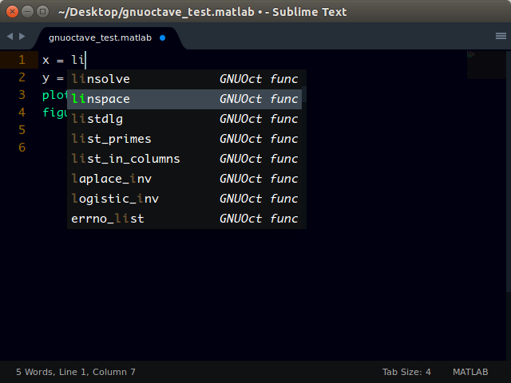

# GNU Octave Completions (GnuOC)

## About

This Sublime text package gives method completion suggestions for [GNU Octave](http://www.gnu.org/software/octave/).

## Screenshot

## How to Use

Just type the words and the completion suggestions should show up. If you still don't understand how to use it. Just flow along.

> **Note:** For best result, you can disable [Matlab Completions](https://github.com/tushortz/Matlab-Completions/) (if installed) so that only the GUI methods would show up in the completion lists.

## Installation
> Important: You need to have `Package Control` installed first on your sublime text which can be found at [The Package Contol Website](http://packagecontrol.io).

### Using Package Control's Repository

Go to `Preferences` --> `Package Control` --> `Add Repository` --> then type into the textbox `https://github.com/tushortz/GNU-Octave-Completions`

After doing this, then go to: `Preferences` --> `Package Control` --> `Install Package` --> then search `GNU Octave Completions` and click it.

The package will be installed and ready for use.

### Using Git

Locate your Sublime Text 2 `Packages` directory by using the menu item `Preferences -> Browse Packages...`.

While inside the `Packages` directory, clone the theme repository using the command below:

    git clone https://github.com/tushortz/GNU-Octave-Completions.git

### Download Manually

* [Download the files](https://github.com/tushortz/GNU-Octave-Completions/archive/master.zip) (using the GitHub .zip download option),
* Unzip the files,
* Copy the folder to your Sublime Text `Packages` directory.

## Contributing

All contributions are welcome. 

## License
© 2015 Taiwo Kareem | taiwo.kareem36@gmail.com.

Read **license.txt**

## Acknowledgements
I'd first like to say a very big thank you to God my creator. Without him, this wouldn't be possible.
